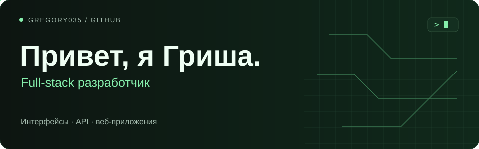

  

Пишу на TypeScript и Python. Собираю веб-приложения целиком: интерфейс, API, базу данных и запуск в Docker.

Сейчас работаю над сервисом онлайн-записи через Telegram и ищу стажировку в продуктовой команде.

### Что я делаю

**[Slotty ↗](https://github.com/Gregory035/telegram-business-saas)**

Онлайн-запись для малого бизнеса через Telegram. Панель управления на React, API на NestJS, PostgreSQL и Redis. Всё в одном монорепозитории с Docker и CI.

TypeScript · React · NestJS · Prisma · PostgreSQL · Redis

**[Justice Law ↗](https://github.com/Gregory035/justice-law-landing)**

Адаптивный лендинг юридической компании: карточки услуг, модальное окно и форма заявки.

React · Vite · CSS

**[Prima Booking ↗](https://github.com/Gregory035/prima-booking)**

Учебный сервис записи на услуги. Административная панель, заявки и работа с базой данных.

Python · Flask · SQLite

### С чем работаю

  
  
  
  
  
  
  
  
  

